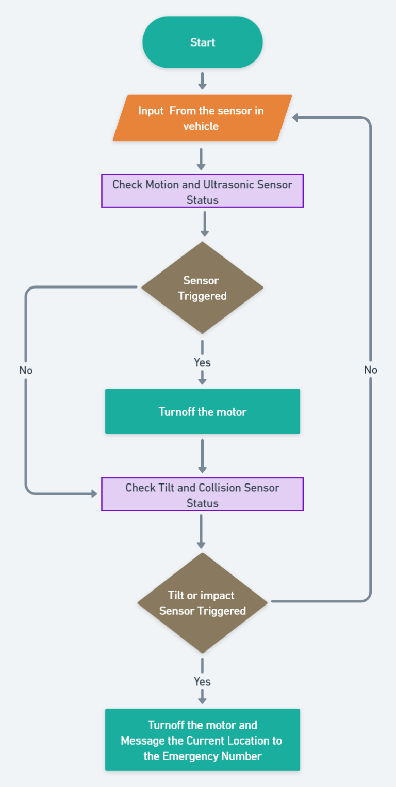

# IoT Based two-side safety vehicles

It is a simple IoT system which is used to avoid accidents, but in case to reduce impact. I have made this for learning about IoT.

## Problem Statement

- Pedestrian deaths account for around 30% of all deaths from road traffic crashes in India. In some large Indian cities the proportions of pedestrians killed is up to 60% of all road traffic deaths.
- One serious road accident in the country occurs every minute and 16 die on Indian roads every hour. Around 1214 road crashes occur every day in India.

## Solution / Idea Overview

- As a solution to the above problem, we are developing an lOT system that can be implemented in vehicles to avoid the chances of accidents and damage caused by those accidents to pedestrians.
- In case of accidents due to rash driving or if the vehicle crashes into the obstacle, the system immediately stops the wheels which prevents the further drift of the vehicle.
- If accident is caused, system notifies and sends the accident location to the emergency number

## Tech Stack

#### Hardware components

- TTGO TCALL SIM 800L (ESP32 + SIM module)
- PIR Motion Sensor
- Tilt Sensor
- Ultrasonic Sensor
- Impact switch
- Motor Driver/ Motor
- LCD Display
- Buzzer

#### Software and programming language

- Arduino IDE
- Embedded C/C++

## System Flow

## Prototype Photo

## Thank You

### Don't forget to give a star if you like it or its helpful.
